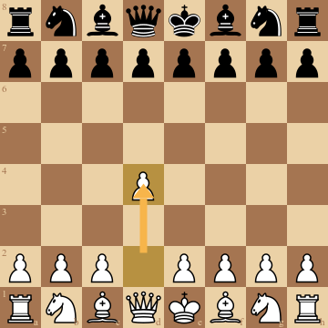

# chess
[](https://github.com/notnil/chess/actions/workflows/build-and-test.yaml)
[](https://godoc.org/github.com/notnil/chess)
[](https://coveralls.io/github/notnil/chess?branch=master)
[](https://goreportcard.com/report/notnil/chess)
[](https://raw.githubusercontent.com/notnil/chess/master/LICENSE)

## Introduction

**chess** is a set of go packages which provide common chess utilities such as move generation, turn management, checkmate detection, PGN encoding, UCI interoperability, image generation, opening book exploration, and others.  It is well tested and optimized for performance.   

    


## Repo Structure

| Package | Docs Link | Description |
| ------------- | ------------- | ------------- |
| **chess**  | [notnil/chess](README.md)  | Move generation, serialization / deserialization, turn management, checkmate detection  |
| **image**  | [notnil/chess/image](image/README.md)  | SVG chess board image generation  |
| **opening**  | [notnil/chess/opening](opening/README.md)  | Opening book interactivity  |
| **uci**  | [notnil/chess/uci](uci/README.md)  | Universal Chess Interface client  |

## Installation

**chess** can be installed using "go get".

```bash
go get -u github.com/notnil/chess
``` 

## Usage

### Example Random Game 

```go
package main

import (
	"fmt"
	"math/rand"

	"github.com/notnil/chess"
)

func main() {
	game := chess.NewGame()
	// generate moves until game is over
	for game.Outcome() == chess.NoOutcome {
		// select a random move
		moves := game.ValidMoves()
		move := moves[rand.Intn(len(moves))]
		game.Move(move)
	}
	// print outcome and game PGN
	fmt.Println(game.Position().Board().Draw())
	fmt.Printf("Game completed. %s by %s.\n", game.Outcome(), game.Method())
	fmt.Println(game.String())
	/*
		Output:

		 A B C D E F G H
		8- - - - - - - -
		7- - - - - - ♚ -
		6- - - - ♗ - - -
		5- - - - - - - -
		4- - - - - - - -
		3♔ - - - - - - -
		2- - - - - - - -
		1- - - - - - - -

		Game completed. 1/2-1/2 by InsufficientMaterial.

		1.Nc3 b6 2.a4 e6 3.d4 Bb7 ...
	*/
}
```

### Example Stockfish v. Stockfish
```go
package main

import (
	"fmt"
	"time"

	"github.com/notnil/chess"
	"github.com/notnil/chess/uci"
)

func main() {
	// set up engine to use stockfish exe
	eng, err := uci.New("stockfish")
	if err != nil {
		panic(err)
	}
	defer eng.Close()
	// initialize uci with new game
	if err := eng.Run(uci.CmdUCI, uci.CmdIsReady, uci.CmdUCINewGame); err != nil {
		panic(err)
	}
	// have stockfish play speed chess against itself (10 msec per move)
	game := chess.NewGame()
	for game.Outcome() == chess.NoOutcome {
		cmdPos := uci.CmdPosition{Position: game.Position()}
		cmdGo := uci.CmdGo{MoveTime: time.Second / 100}
		if err := eng.Run(cmdPos, cmdGo); err != nil {
			panic(err)
		}
		move := eng.SearchResults().BestMove
		if err := game.Move(move); err != nil {
			panic(err)
		}
	}
	fmt.Println(game.String())
	// Output: 
	// 1.c4 c5 2.Nf3 e6 3.Nc3 Nc6 4.d4 cxd4 5.Nxd4 Nf6 6.a3 d5 7.cxd5 exd5 8.Bf4 Bc5 9.Ndb5 O-O 10.Nc7 d4 11.Na4 Be7 12.Nxa8 Bf5 13.g3 Qd5 14.f3 Rxa8 15.Bg2 Rd8 16.b4 Qe6 17.Nc5 Bxc5 18.bxc5 Nd5 19.O-O Nc3 20.Qd2 Nxe2+ 21.Kh1 d3 22.Bd6 Qd7 23.Rab1 h6 24.a4 Re8 25.g4 Bg6 26.a5 Ncd4 27.Qb4 Qe6 28.Qxb7 Nc2 29.Qxa7 Ne3 30.Rb8 Nxf1 31.Qb6 d2 32.Rxe8+ Qxe8 33.Qb3 Ne3 34.h3 Bc2 35.Qxc2 Nxc2 36.Kh2 d1=Q 37.h4 Qg1+ 38.Kh3 Ne1 39.h5 Qxg2+ 40.Kh4 Nxf3#  0-1
}
```

### Movement

Chess exposes two ways of moving: valid move generation and notation parsing.  Valid moves are calculated from the current position and are returned from the ValidMoves method.  Even if the client isn't a go program (e.g. a web app) the list of moves can be serialized into their string representation and supplied to the client.  Once a move is selected the MoveStr method can be used to parse the selected move's string.  

#### Valid Moves

Valid moves generated from the game's current position:

```go
game := chess.NewGame()
moves := game.ValidMoves()
game.Move(moves[0])
fmt.Println(moves[0]) // b1a3
```

#### Parse Notation

Game's MoveStr method accepts string input using the default Algebraic Notation:

```go
game := chess.NewGame()
if err := game.MoveStr("e4"); err != nil {
	// handle error
}
```

### Outcome

The outcome of the match is calculated automatically from the inputted moves if possible.  Draw agreements, resignations, and other human initiated outcomes can be inputted as well.  

#### Checkmate

Black wins by checkmate (Fool's Mate):   

```go
game := chess.NewGame()
game.MoveStr("f3")
game.MoveStr("e6")
game.MoveStr("g4")
game.MoveStr("Qh4")
fmt.Println(game.Outcome()) // 0-1
fmt.Println(game.Method()) // Checkmate
/*
 A B C D E F G H
8♜ ♞ ♝ - ♚ ♝ ♞ ♜
7♟ ♟ ♟ ♟ - ♟ ♟ ♟
6- - - - ♟ - - -
5- - - - - - - -
4- - - - - - ♙ ♛
3- - - - - ♙ - -
2♙ ♙ ♙ ♙ ♙ - - ♙
1♖ ♘ ♗ ♕ ♔ ♗ ♘ ♖
*/
``` 

#### Stalemate

Black king has no safe move:

```go
fenStr := "k1K5/8/8/8/8/8/8/1Q6 w - - 0 1"
fen, _ := chess.FEN(fenStr)
game := chess.NewGame(fen)
game.MoveStr("Qb6")
fmt.Println(game.Outcome()) // 1/2-1/2
fmt.Println(game.Method())  // Stalemate
/*
 A B C D E F G H
8♚ - ♔ - - - - -
7- - - - - - - -
6- ♕ - - - - - -
5- - - - - - - -
4- - - - - - - -
3- - - - - - - -
2- - - - - - - -
1- - - - - - - -
*/
```

#### Resignation

Black resigns and white wins:

```go
game := chess.NewGame()
game.MoveStr("f3")
game.Resign(chess.Black)
fmt.Println(game.Outcome()) // 1-0
fmt.Println(game.Method()) // Resignation
```

#### Draw Offer

Draw by mutual agreement:

```go
game := chess.NewGame()
game.Draw(chess.DrawOffer)
fmt.Println(game.Outcome()) // 1/2-1/2
fmt.Println(game.Method())  // DrawOffer
```

#### Threefold Repetition

[Threefold repetition](https://en.wikipedia.org/wiki/Threefold_repetition) occurs when the position repeats three times (not necessarily in a row).  If this occurs both players have the option of taking a draw, but aren't required until Fivefold Repetition.

```go
game := chess.NewGame()
moves := []string{"Nf3", "Nf6", "Ng1", "Ng8", "Nf3", "Nf6", "Ng1", "Ng8"}
for _, m := range moves {
	game.MoveStr(m)
}
fmt.Println(game.EligibleDraws()) //  [DrawOffer ThreefoldRepetition]
```

#### Fivefold Repetition

According to the [FIDE Laws of Chess](http://www.fide.com/component/handbook/?id=171&view=article) if a position repeats five times then the game is drawn automatically.  

```go
game := chess.NewGame()
moves := []string{
	"Nf3", "Nf6", "Ng1", "Ng8",
	"Nf3", "Nf6", "Ng1", "Ng8",
	"Nf3", "Nf6", "Ng1", "Ng8",
	"Nf3", "Nf6", "Ng1", "Ng8",
}
for _, m := range moves {
	game.MoveStr(m)
}
fmt.Println(game.Outcome()) // 1/2-1/2
fmt.Println(game.Method()) // FivefoldRepetition
```

#### Fifty Move Rule

[Fifty-move rule](https://en.wikipedia.org/wiki/Fifty-move_rule) allows either player to claim a draw if no capture has been made and no pawn has been moved in the last fifty moves.  

```go
fen, _ := chess.FEN("2r3k1/1q1nbppp/r3p3/3pP3/pPpP4/P1Q2N2/2RN1PPP/2R4K b - b3 100 23")
game := chess.NewGame(fen)
game.Draw(chess.FiftyMoveRule)
fmt.Println(game.Outcome()) // 1/2-1/2
fmt.Println(game.Method()) // FiftyMoveRule
```

#### Seventy Five Move Rule

According to [FIDE Laws of Chess Rule 9.6b](http://www.fide.com/component/handbook/?id=171&view=article) if 75 consecutive moves have been made without movement of any pawn or any capture, the game is drawn unless the last move was checkmate.

```go
fen, _ := chess.FEN("2r3k1/1q1nbppp/r3p3/3pP3/pPpP4/P1Q2N2/2RN1PPP/2R4K b - b3 149 23")
game := chess.NewGame(fen)
game.MoveStr("Kf8")
fmt.Println(game.Outcome()) // 1/2-1/2
fmt.Println(game.Method()) // SeventyFiveMoveRule
```  

#### Insufficient Material

[Impossibility of checkmate](https://en.wikipedia.org/wiki/Draw_%28chess%29#Draws_in_all_games), or insufficient material, results when neither white or black has the pieces remaining to checkmate the opponent.

```go
fen, _ := chess.FEN("8/2k5/8/8/8/3K4/8/8 w - - 1 1")
game := chess.NewGame(fen)
fmt.Println(game.Outcome()) // 1/2-1/2
fmt.Println(game.Method()) // InsufficientMaterial
```

### PGN

[PGN](https://en.wikipedia.org/wiki/Portable_Game_Notation), or Portable Game Notation, is the most common serialization format for chess matches.  PGNs include move history and metadata about the match.  Chess includes the ability to read and write the PGN format.  

#### Example PGN

```
[Event "F/S Return Match"]
[Site "Belgrade, Serbia JUG"]
[Date "1992.11.04"]
[Round "29"]
[White "Fischer, Robert J."]
[Black "Spassky, Boris V."]
[Result "1/2-1/2"]

1. e4 e5 2. Nf3 Nc6 3. Bb5 a6 {This opening is called the Ruy Lopez.}
4. Ba4 Nf6 5. O-O Be7 6. Re1 b5 7. Bb3 d6 8. c3 O-O 9. h3 Nb8 10. d4 Nbd7
11. c4 c6 12. cxb5 axb5 13. Nc3 Bb7 14. Bg5 b4 15. Nb1 h6 16. Bh4 c5 17. dxe5
Nxe4 18. Bxe7 Qxe7 19. exd6 Qf6 20. Nbd2 Nxd6 21. Nc4 Nxc4 22. Bxc4 Nb6
23. Ne5 Rae8 24. Bxf7+ Rxf7 25. Nxf7 Rxe1+ 26. Qxe1 Kxf7 27. Qe3 Qg5 28. Qxg5
hxg5 29. b3 Ke6 30. a3 Kd6 31. axb4 cxb4 32. Ra5 Nd5 33. f3 Bc8 34. Kf2 Bf5
35. Ra7 g6 36. Ra6+ Kc5 37. Ke1 Nf4 38. g3 Nxh3 39. Kd2 Kb5 40. Rd6 Kc5 41. Ra6
Nf2 42. g4 Bd3 43. Re6 1/2-1/2
```

#### Read PGN

PGN supplied as an optional parameter to the NewGame constructor:  

```go
pgn, err := chess.PGN(pgnReader)
if err != nil {
	// handle error
}
game := chess.NewGame(pgn)
```

#### Write PGN

Moves and tag pairs added to the PGN output:

```go
game := chess.NewGame()
game.AddTagPair("Event", "F/S Return Match")
game.MoveStr("e4")
game.MoveStr("e5")
fmt.Println(game)
/*
[Event "F/S Return Match"]

1.e4 e5  *
*/
```

#### Scan PGN

For parsing large PGN database files use Scanner:

```go
f, err := os.Open("lichess_db_standard_rated_2013-01.pgn")
if err != nil {
	panic(err)
}
defer f.Close()

scanner := chess.NewScanner(f)
for scanner.Scan() {
	game := scanner.Next()
	fmt.Println(game.GetTagPair("Site"))
	// Output &{Site https://lichess.org/8jb5kiqw}
}
```

### FEN

[FEN](https://en.wikipedia.org/wiki/Forsyth–Edwards_Notation), or Forsyth–Edwards Notation, is the standard notation for describing a board position.  FENs include piece positions, turn, castle rights, en passant square, half move counter (for [50 move rule](https://en.wikipedia.org/wiki/Fifty-move_rule)), and full move counter. 

#### Read FEN

FEN supplied as an optional parameter to the NewGame constructor:

```go
fen, err := chess.FEN("rnbqkbnr/pppppppp/8/8/8/8/PPPPPPPP/RNBQKBNR w KQkq - 0 1")
if err != nil {
	// handle error
}
game := chess.NewGame(fen)
```

#### Write FEN

Game's current position outputted in FEN notation:

```go
game := chess.NewGame()
pos := game.Position()
fmt.Println(pos.String()) // rnbqkbnr/pppppppp/8/8/8/8/PPPPPPPP/RNBQKBNR w KQkq - 0 1
```

### Notations

[Chess Notation](https://en.wikipedia.org/wiki/Chess_notation) define how moves are encoded in a serialized format.  Chess uses a notation when converting to and from PGN and for accepting move text.    
#### Algebraic Notation

[Algebraic Notation](https://en.wikipedia.org/wiki/Algebraic_notation_(chess)) (or Standard Algebraic Notation) is the official chess notation used by FIDE. Examples: e2, e5, O-O (short castling), e8=Q (promotion)

```go
game := chess.NewGame(chess.UseNotation(chess.AlgebraicNotation{}))
game.MoveStr("e4")
game.MoveStr("e5")
fmt.Println(game) // 1.e4 e5  *
```

#### Long Algebraic Notation

[Long Algebraic Notation](https://https://en.wikipedia.org/wiki/Algebraic_notation_(chess)#Long_algebraic_notation) LongAlgebraicNotation is a more beginner friendly alternative to algebraic notation, where the origin of the piece is visible as well as the destination. Examples: Rd1xd8+, Ng8f6.

```go
game := chess.NewGame(chess.UseNotation(chess.LongAlgebraicNotation{}))
game.MoveStr("f2f3")
game.MoveStr("e7e5")
game.MoveStr("g2g4")
game.MoveStr("Qd8h4")
fmt.Println(game) // 1.f2f3 e7e5 2.g2g4 Qd8h4#  0-1
```

#### UCI Notation

UCI notation is a more computer friendly alternative to algebraic notation. This notation is the Universal Chess Interface notation. Examples: e2e4, e7e5, e1g1 (white short castling), e7e8q (for promotion)

```go
game := chess.NewGame(chess.UseNotation(chess.UCINotation{}))
game.MoveStr("e2e4")
game.MoveStr("e7e5")
fmt.Println(game) // 1.e2e4 e7e5  *
```

#### Text Representation

Board's Draw() method can be used to visualize a position using unicode chess symbols.  

```go
game := chess.NewGame()
fmt.Println(game.Position().Board().Draw())
/*
 A B C D E F G H
8♜ ♞ ♝ ♛ ♚ ♝ ♞ ♜
7♟ ♟ ♟ ♟ ♟ ♟ ♟ ♟
6- - - - - - - -
5- - - - - - - -
4- - - - - - - -
3- - - - - - - -
2♙ ♙ ♙ ♙ ♙ ♙ ♙ ♙
1♖ ♘ ♗ ♕ ♔ ♗ ♘ ♖
*/
```

### Move History

Move History is a convenient API for accessing aligned positions, moves, and comments.  Move
History is useful when trying to understand detailed information about a game.  Below is an 
example showing how to see which side castled first. 

```go
package main

import (
	"fmt"
	"os"

	"github.com/notnil/chess"
)

func main() {
	f, err := os.Open("fixtures/pgns/0001.pgn")
	if err != nil {
		panic(err)
	}
	defer f.Close()
	pgn, err := chess.PGN(f)
	if err != nil {
		panic(err)
	}
	game := chess.NewGame(pgn)
	color := chess.NoColor
	for _, mh := range game.MoveHistory() {
		if mh.Move.HasTag(chess.KingSideCastle) || mh.Move.HasTag(chess.QueenSideCastle) {
			color = mh.PrePosition.Turn()
			break
		}
	}
	switch color {
	case chess.White:
		fmt.Println("white castled first")
	case chess.Black:
		fmt.Println("black castled first")
	default:
		fmt.Println("no side castled")
	}
}
```

## Performance

Chess has been performance tuned, using [pprof](https://golang.org/pkg/runtime/pprof/), with the goal of being fast enough for use by chess bots.  The original map based board representation was replaced by [bitboards](https://chessprogramming.wikispaces.com/Bitboards) resulting in a large performance increase.

### Benchmarks  

The benchmarks can be run with the following command:
```
go test -bench=.
```

Results from the baseline 2015 MBP:
```
BenchmarkBitboardReverse-4              2000000000               1.01 ns/op
BenchmarkStalemateStatus-4                500000              3116 ns/op
BenchmarkInvalidStalemateStatus-4         500000              2290 ns/op
BenchmarkPositionHash-4                  1000000              1864 ns/op
BenchmarkValidMoves-4                     100000             13445 ns/op
BenchmarkPGN-4                               300           5549192 ns/op
```
